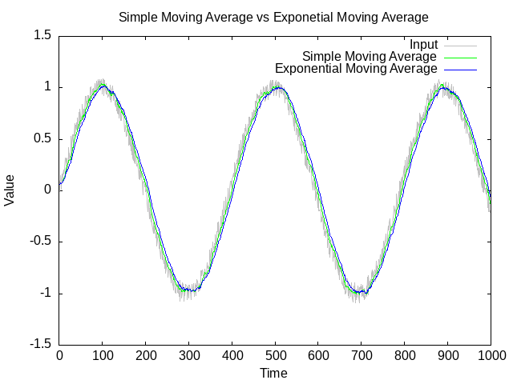

# sensor_smoother.c

<versionBadge></versionBadge>
[](https://opensource.org/licenses/MIT)
[](https://en.wikipedia.org/wiki/C_(programming_language))
[](https://github.com/mofosyne/sensor_smoother.c/actions)



A small collection of sensor smoothing functions designed for embedded devices and other resource-constrained environments.

Pull requests and contributions are welcome!

## Design Considerations

* Minimal runtime checks are enabled by default to catch common misconfigurations (e.g., null buffers or invalid alpha). This balances safety and performance, especially important in embedded systems.
* Runtime checks can be disabled via compile-time flags to eliminate overhead when inputs are guaranteed valid.
* The simple moving average requires the user to supply and manage the buffer, giving flexibility in buffer sizing and memory management.
* The exponential moving average maintains internal state and requires setting a smoothing factor alpha between 0 and 1 (exclusive).
* No dynamic memory allocation is performed inside the functions — all memory management is left to the user, ideal for embedded environments.
* The library uses `float` (single precision) as it is the most common size for sensor data in embedded platforms.
    - Users needing `double` precision can modify the source code accordingly, and contributions to support this are welcome.

## Usage

### Simple Moving Average

The simple moving average function maintains a circular buffer of recent input values and returns their average. The user must allocate and manage this buffer.

```c
sensor_smoother_simple_moving_average_t sma_state = {0};
sma_state.buffer = buffer; // pre-allocated float array
sma_state.buffer_size = sizeof(buffer) / sizeof(buffer[0]);

float smoothed_value = sensor_smoother_simple_moving_average(&sma_state, input);
```

The function performs runtime validation by default:
* Returns the input value unchanged if the buffer is null or buffer size is zero.

### Exponential Moving Average

The exponential moving average uses a smoothing factor `alpha` between 0 (exclusive) and 1 (exclusive) to weight new input values. Smaller alpha values smooth more aggressively.

```c
sensor_smoother_exponential_moving_average_t ema_state = {0};
ema_state.alpha = 0.1f;  // Smoothing factor: 0 < alpha < 1

float smoothed_value = sensor_smoother_exponential_moving_average(&ema_state, input);
```

The function performs runtime validation by default:
* Returns the input value unchanged if alpha is not strictly between 0 and 1.

### Compile-time Flags

These macros can be defined to disable internal parameter validation, reducing runtime overhead:
* `DISABLE_SENSOR_SMOOTHER_SIMPLE_MOVING_AVERAGE_CHECKS`: Disable null buffer and zero-size checks in the simple moving average function.
* `DISABLE_SENSOR_SMOOTHER_EXPONENTIAL_MOVING_AVERAGE_CHECKS`: Disable alpha range checks in the exponential moving average function.

Great — since you already have a `clib.json`, you can guide users to install your library using [`clib`](https://github.com/clibs/clib), the lightweight C package manager.

Here’s a clean **"Installation"** section you can add to your README:

## Installation Via Clib

You can install this library using [clib](https://github.com/clibs/clib):

```sh
clib install mofosyne/sensor_smoother.c
```

This will download `sensor_smoother.c` and `sensor_smoother.h` into your project’s `deps/` directory. You can then include the header in your source files:

```c
#include "sensor_smoother.h"
```

Make sure to compile the `.c` file with your project and include the `deps/` path if needed.
