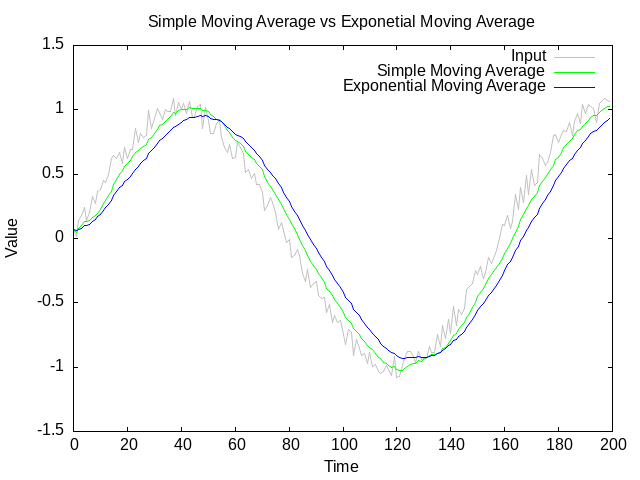

# sensor_smoother.c

<versionBadge></versionBadge>
[](https://opensource.org/licenses/MIT)
[](https://en.wikipedia.org/wiki/C_(programming_language))
[](https://github.com/mofosyne/sensor_smoother.c/actions)



This is a small collection of sensor smoothing functions that may be
useful for embedded devices etc...

Pull Requests and Other Contributions Are Welcomed

## Design Considerations

* No checks for settings via initialiser or parameter checks
    - Keeps compexity lower
* Simple moving average requires users to supply their own buffer. 
    - This allows for custom sizes between multiple different sensors.

## Usage

Below are some examples code for simple moving average and exponential
moving average smoothers:

```c
sensor_smoother_simple_moving_average_t sma_state = {0};
sma_state.buffer = buffer;
sma_state.buffer_size = sizeof(buffer) / sizeof(buffer[0]);
float sma = sensor_smoother_simple_moving_average(&sma_state, input);
```

The exponential moving average function below on the other hand requires
that you set an alpha smoothing factor that is between 0.0 to 1.0 for
how responsive the output is to the input values. Set alpha nearer to
zero for slower response while setting alpha to 1.0 will get exactly
the input value. You will want to pick a value inbetween but closer to
zero to smooth the input signal out.

```c
sensor_smoother_exponential_moving_average_t ema_state = {0};
ema_state.alpha = 0.1; ///<  Smoothing factor (0 <= alpha < 1)
float ema = sensor_smoother_exponential_moving_average(&ema_state, input);
```
